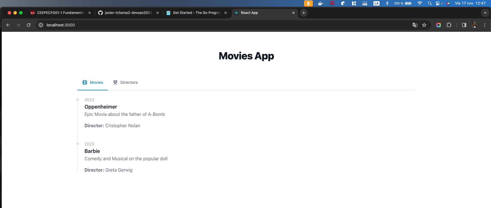

# Javier Teillier

## Preguntas

1.- Revisa el contenido del directorio sql_migrations. ¿Cuál es la diferencia entre los archivos con el verbo Create con los archivos con el verbo Add?

R: Los archivos con el verbo `Create` tienen consultas que crean tablas en la base de datos, mientras que los con el verbo `Add` tienen consultas que insertan datos en las tablas de la base de datos.

2.- ¿Qué pasa si cambias el nombre del servicio de postgres a db? ¿Qué otros cambios tendrías que hacer?

R: El servicio pasaría a llamarse db, por lo tanto se debería cambiar la variable de entorno `POSTGRES_SERVER` a `db`. A menos que se especifique el nombre del contenedor usando `container_name`.

3.- Si quisieramos que el servicio movies-api use el puerto 81, ¿Qué cambios habría que hacer? 

R: Lo primero sería modificar el archivo `main.go` para que use el puerto desde una variable de entorno (estaba en duro en 8080 y en mi PR lo modifiqué para que use el puerto configurado en el entorno).

```
import (
	"os"
	"github.com/spf13/cobra"
)

func main() {
	var bind string
	var port string = "8080"

	envPort := os.Getenv("BIND_PORT")
	if envPort != "" {
		port = envPort
	}
  ...
```

Luego se debe modificar en el archivo `.env` la variable `BIND_PORT` al valor 81. De esta manera queda el servicio usando dicha variable.

4.- ¿Qué pasa si a la variable de ambiente `BIND_IP` le asignas el valor localhost?

El servicio levanta correctamente, pero no se puede acceder a éste desde el exterior.

5.- Revisa el archivo `Dockerfile` en la carpeta `movies-api`. ¿Qué te llama la atención? Trata de explicar lo que ocurre en este caso.

R: Veo que tiene 2 etapas, la primera usa una imagen de `golang` y le pone la etiqueta `build-stage`, que es donde hace el build de la aplicación, luego la salida de esta etapa es usada para copiarlo en el servicio en la línea 28 que es donde se ejecutará finalmente.

Recuerda responder en el archivo `RESPUESTAS.md` y agregar tu nombre en ese archivo.

## Evidencia


